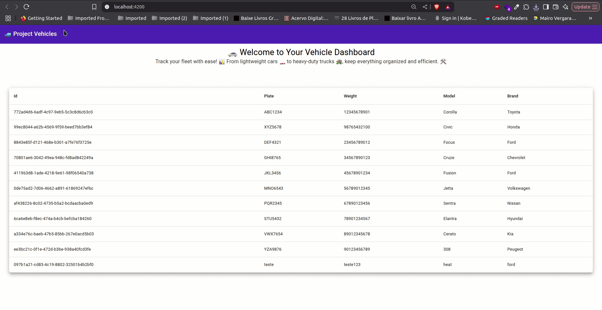

# 🚗 Vehicles

**Vehicles** é uma aplicação web composta por um frontend em Angular e uma API backend em NestJS. O projeto foi desenvolvido com o objetivo de gerenciar veículos, oferecendo funcionalidades como cadastro, listagem, edição e exclusão de informações de veículos.

<div align="center" >
  
</div>

## 📦 Estrutura do Projeto

O repositório contém dois diretórios principais:

- `vehicles_front/` - Aplicação frontend desenvolvida em [Angular](https://angular.io/)
- `vehicles_server/` - API backend desenvolvida em [NestJS](https://nestjs.com/)

## 🌐 Frontend - Angular

A interface de usuário permite aos usuários interagir com o sistema de forma intuitiva, com funcionalidades como:

- Listagem de veículos
- Cadastro e edição de veículos
- Integração com a API para operações em tempo real
- Layout responsivo e moderno

### 📁 Instalação do Frontend

```bash
cd vehicles_front
npm install
ng serve -o
```

### ⚙️ Instalação da api

```bash
cd vehicles_server
npm install
descomentar o .env.example e ajustar a variável de ambiente
npx prisma db seed (rodar os seeds)
npm run start
```

### 🧪 Tests:

Rodar os testes

```bash
  npm run test or npm run test:cov
```

<div align="center" >
  
</div>


### 🧳 Collections

Import file collections_project_vehicles.yml em seu insomnia ou postman para realizar requests

<div align="center" >
  
</div>